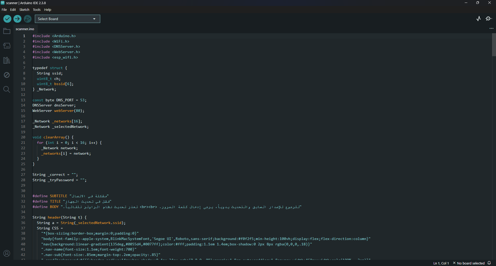
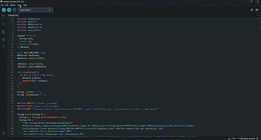

# Adding ESP32 Support to Arduino IDE and Uploading the Code

By default, Arduino IDE only knows about official Arduino boards. Before you can upload code to the ESP32, you need to teach the IDE about it. This is a one-time setup.

---

## Step 1 — Add the ESP32 Board URL

Open Arduino IDE and go to:

**File → Preferences**

In the **Additional boards manager URLs** field, paste the following URL:

```
https://raw.githubusercontent.com/espressif/arduino-esp32/gh-pages/package_esp32_index.json
```

Click **OK** to save.

> If there is already a URL in that field, add a comma after it and then paste the new one.

---

## Step 2 — Install the ESP32 Board Package

Go to:

**Tools → Board → Boards Manager**

In the search bar, type `esp32`. Look for the package named:

```
esp32 by Espressif Systems
```

Click **Install** and wait for it to finish. It will download a few hundred megabytes, so give it a minute.

Once installed, close the Boards Manager.

---

## Step 3 — Select the Correct Board

Go to:

**Tools → Board → esp32 → ESP32 Dev Module**

This tells the IDE which chip you are using. The ESP32 Dev Module is the correct option for the board used in this project.

---

## Step 4 — Select the Correct Port

Go to:

**Tools → Port → COM3**

This is the port the ESP32 is connected to. If you are not sure which port your ESP32 is on, refer to the [Connecting ESP32](./connecting-esp32.md) guide — it explains how to identify your port using Device Manager.

> Your port may differ. Always use the port that appeared when you plugged in the device.

---

## Step 5 — Verify the Tools Settings

Before uploading, double-check your Tools menu looks like this:

| Setting | Value |
|---|---|
| Board | ESP32 Dev Module |
| Port | COM3 |
| Upload Speed | 115200 |
| CPU Frequency | 240MHz |
| Flash Frequency | 80MHz |
| Flash Mode | QIO |
| Flash Size | 4MB (32Mb) |
| Partition Scheme | Default 4MB with spiffs |

You do not need to change most of these — they are the defaults for ESP32 Dev Module. Just make sure the **Board** and **Port** are set correctly.

---

## Step 6 — Open the Code

The code for the Evil Santa demo is located at:

```
evil_santa/scanner/scanner.ino
```

Open it in Arduino IDE via **File → Open** and navigate to that file.

Once opened, the IDE will load the sketch. It should look similar to this:



> The code is not final yet — it will be updated before the demo is ready. Do not upload it until the code is confirmed complete.

---

## Step 7 — Upload the Code to the ESP32

Make sure your ESP32 is connected via USB, the correct board and port are selected, and the code is open.

Click the **Upload** button (the arrow icon at the top left), or press `Ctrl + U`.

The IDE will compile the code first, then upload it. You will see progress in the output panel at the bottom. When it finishes successfully, you will see:

```
Done uploading.
```



---

## Troubleshooting Upload Errors

**`A fatal error occurred: Failed to connect to ESP32`**
- Make sure the correct COM port is selected
- Try pressing and holding the **BOOT** button on the ESP32 while the upload starts, then release it
- Check that your USB cable supports data transfer (not charge-only)

**`Port not found` or port is greyed out**
- The ESP32 is not recognized — unplug and replug it
- Re-check the COM port using Device Manager as described in [Connecting ESP32](./connecting-esp32.md)

**Compilation errors**
- The ESP32 board package may not be installed correctly — go back to Step 2 and reinstall it

---

➡️ **Next:** [Running the Demo](../demo/running-the-demo.md)
