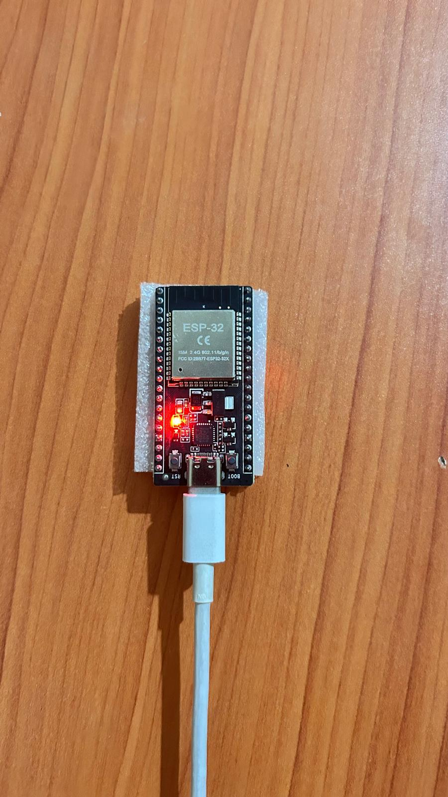
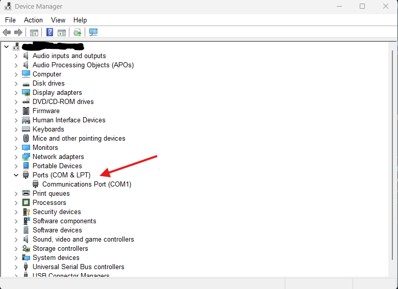
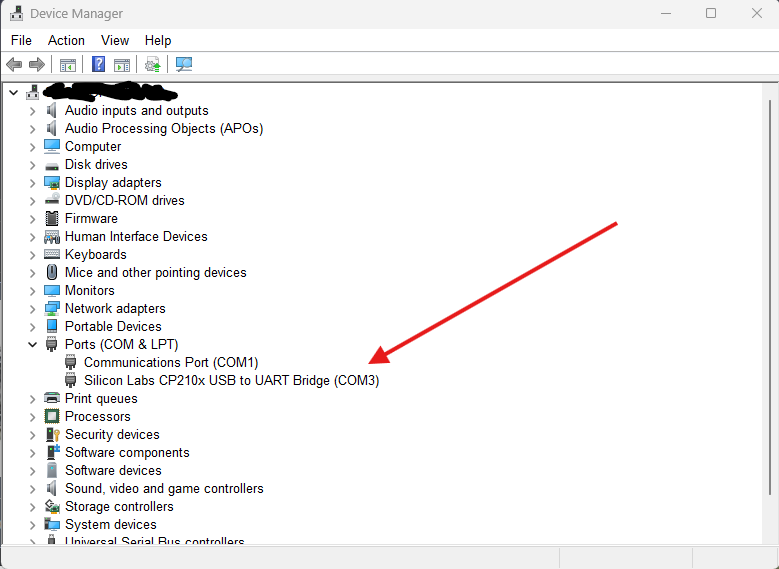

# Connecting the ESP32 to Your Computer

Before you can upload any code to the ESP32, you need to physically connect it and figure out which port your computer assigned to it. This page walks you through both steps.

---

## What You Need

- An ESP32 module
- A USB cable (Type-C or Micro-USB depending on your board variant)
- A Windows computer

---

## Step 1 — Plug It In

Connect the ESP32 to your computer using a USB cable. The board should power on immediately — you will usually see a small LED light up on the board.



---

## Step 2 — Find the COM Port (Very Important)

This is the most important part of the setup. Every device that connects over USB gets assigned a **COM port** by Windows. You need to know which port the ESP32 is on because you will use this information when uploading code.

The easiest and most reliable way to find it:

### Open Device Manager

Press `Win + X` and select **Device Manager**, or search for it in the Start menu.

Expand the **Ports (COM & LPT)** section. Take note of what is listed.

### Before Plugging In

With the ESP32 disconnected, you will only see the ports that already exist on your system. In this example, only `COM1` is present.



### After Plugging In

Now plug in the ESP32 while Device Manager is still open. Watch the **Ports (COM & LPT)** section — a new entry will appear. That new entry is your ESP32.



In this case, the new port that appeared is:

```
Silicon Labs CP210x USB to UART Bridge (COM3)
```

This means the ESP32 is on **COM3**.

> Your port number may be different — it could be COM4, COM5, or any other number. The trick is to compare before and after. Whatever port is **new** after plugging in is the ESP32.

---

## Why This Matters

When you upload code to the ESP32 (for example through the Arduino IDE), you must tell the software which port to use. If you select the wrong port, the upload will fail.

Knowing your COM port also helps when:

- Monitoring serial output from the ESP32 (for debugging)
- Uploading new sketches or firmware
- Verifying that the board is recognized by your computer

---

## Troubleshooting

**The new port does not appear after plugging in**

- Try a different USB cable — some cables are charge-only and do not carry data
- Try a different USB port on your computer
- Make sure the ESP32 is powered on (LED should light up)

**The port appears but disappears after a few seconds**

- The driver may not be installed. The ESP32 (CP2102 variant) requires the **Silicon Labs CP210x driver**. Download it from the Silicon Labs website and install it, then replug the device.

**The port shows up as "Unknown Device"**

- Same issue — missing driver. Install the CP210x driver and try again.

---

## Summary

| Step | Action |
|---|---|
| 1 | Open Device Manager |
| 2 | Expand Ports (COM & LPT) and note what is listed |
| 3 | Plug in the ESP32 |
| 4 | See which new port appeared — that is your ESP32 |
| 5 | Write down the port number (e.g. COM3) — you will need it later |

---

➡️ **Next:** [Setting Up Arduino IDE](./setting-up-arduino-ide.md)
