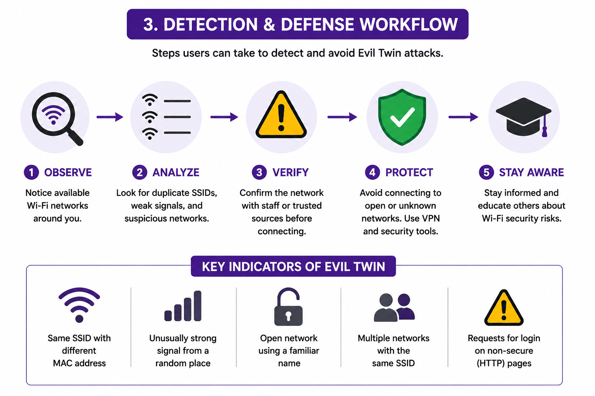

# Detecting and Defending Against Evil Twin Attacks

Knowing how an Evil Twin attack works is only half the picture. The more useful skill is being able to **spot one** and **protect yourself** from it. This page focuses entirely on defense.

---

## The Defense Workflow

Staying safe comes down to five habits:

1. **Observe** — Look at the Wi-Fi networks around you. Are there duplicate names? Does a network appear that shouldn't be here?
2. **Analyze** — Check for the warning signs below. Does something feel off about the signal strength or the lack of a password?
3. **Verify** — Confirm the exact network name and password with staff or a trusted source before connecting.
4. **Protect** — Avoid open or unknown networks. Use a VPN on public Wi-Fi. Stick to HTTPS sites.
5. **Stay Aware** — Share what you know. Most people are caught simply because they have never heard of this attack.

---

## Key Indicators of an Evil Twin Network

| Indicator | What It Means |
|---|---|
| Same SSID, different MAC address | Two networks share a name but run on different hardware — one is fake |
| Unusually strong signal from an odd location | An attacker nearby is boosting their hotspot |
| Open network using a familiar name | A trusted venue suddenly dropping its password is suspicious |
| Multiple networks with the same SSID | Only one of them can be the real one |
| A login page over HTTP (not HTTPS) | A fake captive portal trying to collect your credentials |
| A "router update" or "re-enter your password" prompt | Legitimate networks do not ask for your Wi-Fi password through a web page |

---

## Practical Defenses

### For Individuals

- **Forget open networks after use** so your device does not auto-reconnect to a spoofed copy later.
- **Turn off auto-join** for public Wi-Fi.
- **Use a VPN** — it encrypts your traffic even on a compromised network.
- **Prefer mobile data** for anything sensitive (banking, logins) when on the move.
- **Never enter a Wi-Fi password into a web page.** Real networks authenticate at the system level, not through a browser form.
- **Watch for HTTPS.** A missing padlock on a login page is a major red flag.

### For Network Operators

- **Enable WPA2/WPA3** on all access points. Open networks are the easiest to clone convincingly.
- **Use 802.11w (Protected Management Frames)** to make deauthentication-based attacks much harder.
- **Deploy a Wireless Intrusion Detection System (WIDS)** to alert on rogue APs broadcasting your SSID.
- **Educate users** about your official network name and the fact that you will never ask for credentials via a pop-up page.

---

## If You Suspect an Attack

1. **Disconnect immediately** and switch to mobile data.
2. **Do not enter any credentials** while connected to the suspicious network.
3. **Change any passwords** you may have entered while connected.
4. **Report it** to the venue or your IT/security team so they can investigate the rogue AP.

---

## Key Takeaway

A Wi-Fi name alone proves nothing. Verify before you connect, encrypt your traffic, and never trust a web page that asks for your network password.

---

➡️ **Next:** [Safety, Ethics, and Legal Use](./safety-rules.md)
