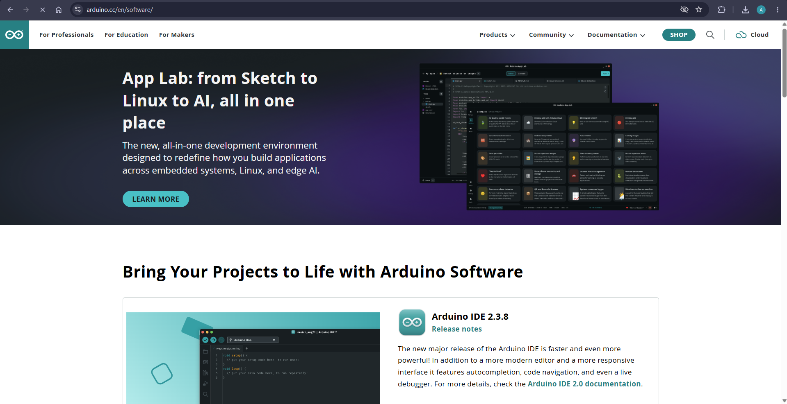
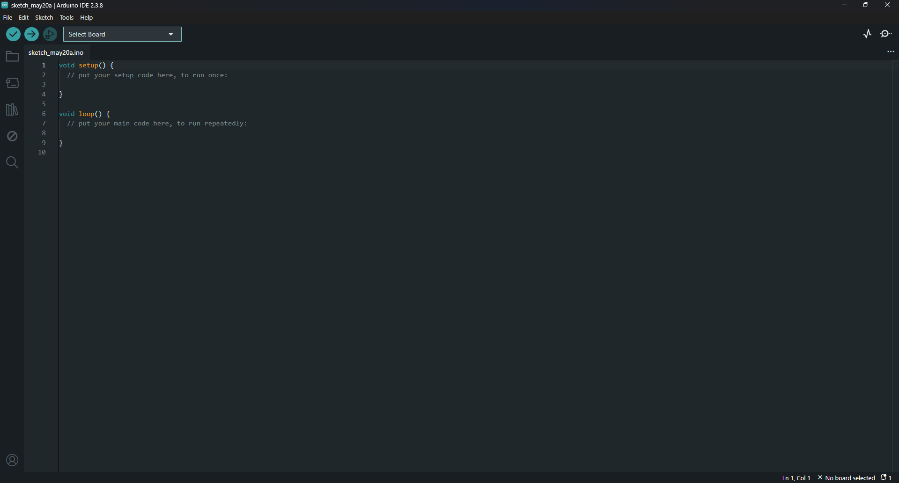

# Setting Up Arduino IDE

Arduino IDE is the software you use to write code and upload it to the ESP32. It is free, beginner-friendly, and runs on Windows, Mac, and Linux.

---

## Step 1 — Download Arduino IDE

Go to the official Arduino website and download the latest version of Arduino IDE:

**[https://www.arduino.cc/en/software](https://www.arduino.cc/en/software)**

Click the download button for your operating system. The current version at the time of writing is **Arduino IDE 2.3.8**.

> Always download from the official Arduino website. Avoid third-party sources.

---

## Step 2 — Install It

Run the installer after the download completes. The installation is straightforward — click through the prompts and accept the default settings. It will also install the necessary USB drivers automatically.

Once installed, open Arduino IDE from your Start menu or desktop shortcut.

---

## Step 3 — Explore the Interface

When you first open Arduino IDE, you will see an empty sketch with two functions already written for you.

Here is what you are looking at:

| Element | What It Does |
|---|---|
| `void setup()` | Runs once when the board powers on — used for initial configuration |
| `void loop()` | Runs repeatedly in a loop — this is where the main logic goes |
| **Select Board** (top bar) | Where you choose which microcontroller you are uploading to |
| **Verify button** (checkmark icon) | Checks your code for errors without uploading |
| **Upload button** (arrow icon) | Compiles and uploads your code to the connected board |
| **No board selected** (bottom right) | Reminder that you have not yet selected a board — you will fix this next |

---

## What's Next

Arduino IDE is now installed, but it does not know about the ESP32 yet — it is set up for official Arduino boards by default. The next step is to add ESP32 support so the IDE can recognize and program your board.

---

➡️ **Next:** [Adding ESP32 Support to Arduino IDE](./adding-esp32-to-arduino-ide.md)
