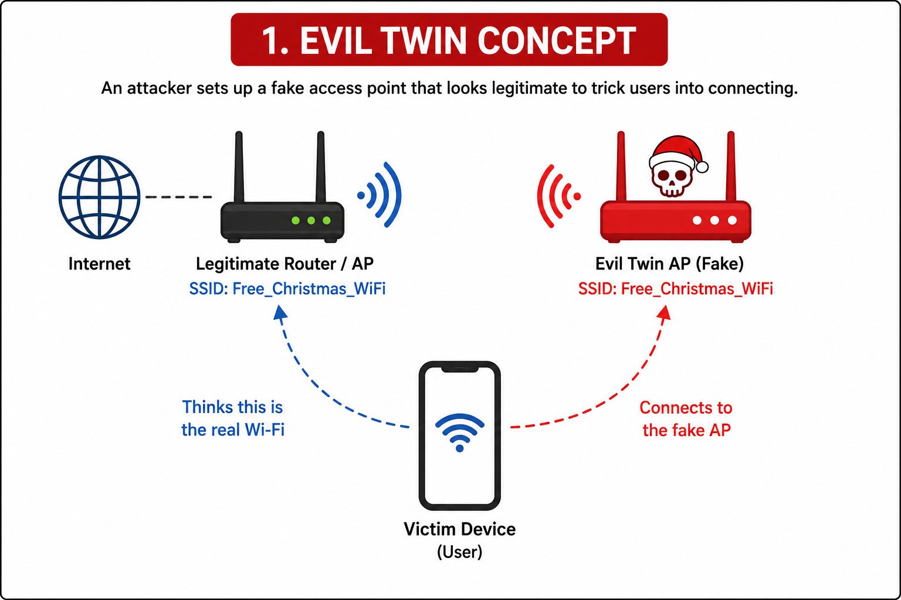
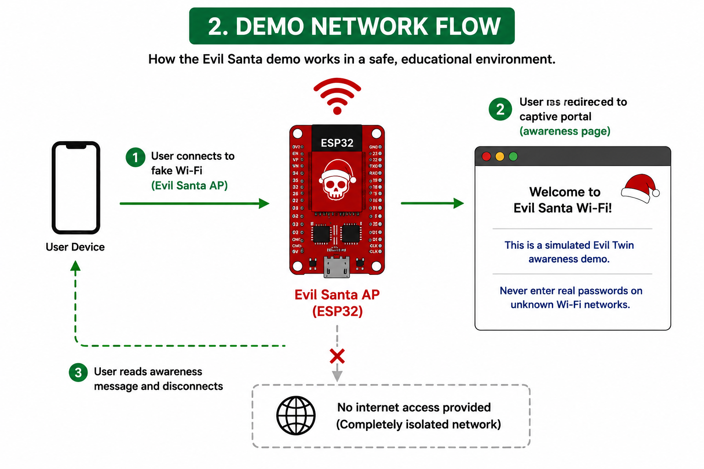

# What Is an Evil Twin Attack?

An **Evil Twin attack** is a wireless attack where a fake access point is created to look exactly like a legitimate Wi-Fi network. The goal is simple: trick you into connecting to the attacker's network instead of the real one — and once you do, everything you send or receive can be intercepted.

---

## How It Works



Here is what happens step by step:

1. **A legitimate router exists** — a real Wi-Fi access point that people use normally (e.g., `Free_Christmas_WiFi`).
2. **The attacker sets up a fake access point** — it broadcasts the exact same network name (SSID).
3. **The victim sees two networks with the same name** — but cannot easily tell which one is real.
4. **The victim connects to the fake AP** — often because it has a stronger signal.
5. **The attacker is now in the middle** — they can see all traffic, redirect the user to fake pages, and steal information.

The victim's device shows a normal Wi-Fi connection. Nothing looks wrong from the outside.

---

## Example Scenario

A coffee shop runs a free Wi-Fi network named:

```
Free_Christmas_WiFi
```

An attacker sitting nearby sets up a hotspot with the same name:

```
Free_Christmas_WiFi
```

Both appear in the Wi-Fi list. The attacker's version may even show a stronger signal because they are physically closer to the target. The victim connects, and the attacker can now intercept their traffic.

---

## Why Users Fall for It

Users connect to fake networks because:

- The SSID looks familiar and trusted
- The fake signal is stronger than the real one
- The network is open — no password needed
- The captive portal (login page) looks official
- The user is in a hurry and does not think twice
- There is no visible warning that anything is wrong

---

## How the Evil Santa Demo Works



This project simulates the concept in a **safe, educational, and isolated environment** using an ESP32 device. Here is what the demo does:

1. **The ESP32 broadcasts a fake Wi-Fi network** called "Evil Santa AP" — no real internet is connected to it.
2. **When a user connects**, they are automatically redirected to a captive portal (an awareness page).
3. **The captive portal shows a clear message** — explaining that this is a simulated Evil Twin demo and warning never to enter passwords on unknown networks.
4. **The user reads the message and disconnects** — no data is collected, no harm is done.

The entire network is isolated. There is no internet access and no traffic interception. The purpose is purely to show how easy it is to connect to a fake network without realizing it.

---

## Key Indicators of an Evil Twin Network

Before connecting to any Wi-Fi, watch for these warning signs:

| Indicator | What It Means |
|---|---|
| Same SSID, different MAC address | Two networks with the same name but different hardware — one is likely fake |
| Unusually strong signal from a random place | An attacker nearby boosting their hotspot signal |
| Open network using a familiar name | Legitimate networks in sensitive places rarely drop their password |
| Multiple networks with the same SSID | Only one can be real |
| Login page over HTTP (not HTTPS) | A fake captive portal trying to steal your credentials |

---

## How to Detect and Protect Yourself


Follow these five steps to stay safe:

1. **Observe** — Look at the available Wi-Fi networks around you. Are there duplicates?
2. **Analyze** — Check for the warning signs listed above. Does something feel off?
3. **Verify** — Confirm the network name and password with staff or a trusted source before connecting.
4. **Protect** — Avoid open or unknown networks. Use a VPN when connecting to public Wi-Fi. Prefer HTTPS websites.
5. **Stay Aware** — Share what you know. Most people fall for these attacks simply because they have never heard of them.

---

## Real-World Risk

Evil Twin attacks are used in real incidents for:

- **Credential theft** — capturing usernames and passwords entered on fake login pages
- **Phishing** — redirecting users to convincing fake websites
- **Traffic interception** — reading unencrypted HTTP data sent over the connection
- **Session hijacking** — stealing browser session cookies to impersonate the victim
- **Social engineering** — combining the above with fake alerts to pressure victims into action

These attacks require no advanced equipment. A laptop or a small device like an ESP32 is enough to run one.

---

## Key Lesson

A Wi-Fi name alone does not prove that a network is safe or real. Always verify before you connect — and when in doubt, use your mobile data instead.

---

➡️ **Next:** [Detecting and Defending Against Evil Twin Attacks](./detection-and-defense.md)
