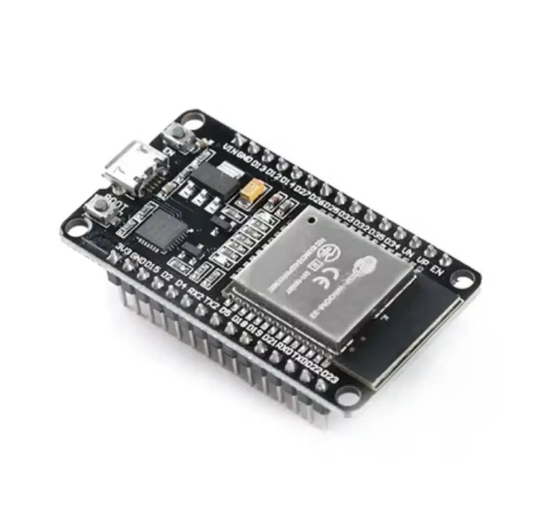

# What Is the ESP32?

The **ESP32** is a small, low-cost microcontroller chip made by a company called **Espressif Systems**. It is roughly the size of a postage stamp, but it packs a surprising amount of capability into that tiny form factor.

Think of it as a tiny computer that can run code, connect to Wi-Fi, communicate over Bluetooth, and interact with the physical world — all without needing a full operating system or a large power source.

---

## Key Specs at a Glance

| Feature | Detail |
|---|---|
| Processor | Dual-core 32-bit CPU (up to 240 MHz) |
| Wi-Fi | 802.11 b/g/n (2.4 GHz) — can act as a client, access point, or both |
| Bluetooth | Classic Bluetooth and BLE (Bluetooth Low Energy) |
| Memory | 520 KB SRAM, external flash storage (typically 4 MB) |
| GPIO Pins | Up to 38 general-purpose input/output pins |
| Power | Runs on 3.3V, can be powered via USB |
| Price | Roughly $3–$10 USD depending on supplier |

---

## What Can It Do?

The ESP32 is used across a huge range of projects because it can both **run logic** and **communicate wirelessly**. Here are common use cases:

### IoT (Internet of Things)
Connect physical devices to the internet. Smart home sensors, temperature loggers, plant watering systems — if it needs to send or receive data wirelessly, the ESP32 can do it.

### Wi-Fi Access Point
The ESP32 can broadcast its own Wi-Fi network. Other devices can connect to it directly, without needing a router. This is exactly what makes it useful for demos like this project.

### Bluetooth Devices
Build custom Bluetooth keyboards, game controllers, BLE beacons, or anything that needs to pair with a phone or laptop.

### Web Server
The ESP32 can host a small website internally. When a device connects to its Wi-Fi, it can serve HTML pages — like a captive portal (the login/info page you sometimes see when joining public Wi-Fi).

### Sensors and Automation
Read data from temperature sensors, motion detectors, buttons, LEDs, motors, and displays. The GPIO pins let it interact with almost any hardware component.

### Security Research and Education
Because it can create Wi-Fi networks and serve web pages, it is widely used in cybersecurity education to demonstrate concepts like evil twin attacks, captive portals, and deauth techniques — in controlled, ethical environments.

---

## Why Is It Used in the Evil Santa Demo?

The Evil Santa project uses the ESP32 because it can do in hardware what normally requires a full laptop setup:

- **Broadcast a fake Wi-Fi network** with a custom SSID
- **Capture connections** from nearby devices
- **Serve a captive portal page** automatically when someone connects
- **Run standalone** — no computer, no internet connection needed
- **Fit in a pocket** — small enough to carry anywhere

This makes it an ideal tool for a portable, self-contained awareness demo.

---

## Programming the ESP32

The ESP32 can be programmed in several ways:

- **Arduino IDE** — the most beginner-friendly option, uses C/C++
- **MicroPython** — write code in Python, great for rapid prototyping
- **ESP-IDF** — Espressif's official framework, more advanced, full control
- **PlatformIO** — a popular IDE extension that supports all of the above

You connect it to your computer via USB, upload your code, and it runs immediately.

---

## Where to Buy One

The ESP32 is widely available online. Below are three options depending on your location:

### Bitware — Bahrain (Used in This Demo)
The exact module used in the Evil Santa project. A Bahraini electronics brand with local shipping.

[Buy from Bitware](https://www.bitware.store/product/esp-32-wireless-wifi-bluetooth-compatible-module/?attribute_type=38+Pin+%28Type+C+-+CP2102%29)

> Recommended: **38 Pin (Type C – CP2102)** variant for easy USB connection.

---

### Amazon Saudi Arabia
Available with fast local shipping across the Gulf region.

[Buy from Amazon.sa](https://www.amazon.sa/%D9%84%D8%A7%D8%B3%D9%84%D9%83%D9%8A%D8%A9-%D8%A8%D8%A7%D9%86%D8%A7%D9%85%D9%8A%D8%B1%D8%A7-KVLHCSVA-%D9%84%D8%A7%D8%B1%D8%AF%D9%88%D9%8A%D9%86%D9%88-%D9%85%D8%A7%D9%8A%D9%83%D8%B1%D9%88%D8%A8%D9%8A%D8%AB%D9%88%D9%86/dp/B09J94LQ67?crid=IS1NYYP8BK1I&sprefix=esp8,aps,135&sr=8-4&language=ar_AE&ref_=as_li_ss_tl)

---

### AliExpress
The most affordable option, ships internationally. Expect 2–4 weeks delivery.

[Buy from AliExpress](https://ar.aliexpress.com/item/1005008464533571.html?tt=CPS_NORMAL&afSmartRedirect=y)

---

## Summary

The ESP32 is one of the most versatile and affordable microcontrollers available today. It is used by hobbyists, engineers, and security researchers alike. For this project, it plays the role of a portable fake access point — a real piece of hardware that makes the Evil Twin concept tangible and easy to demonstrate to anyone, anywhere.

---

➡️ **Next:** [Connecting the ESP32 to Your Computer](./connecting-esp32.md)
